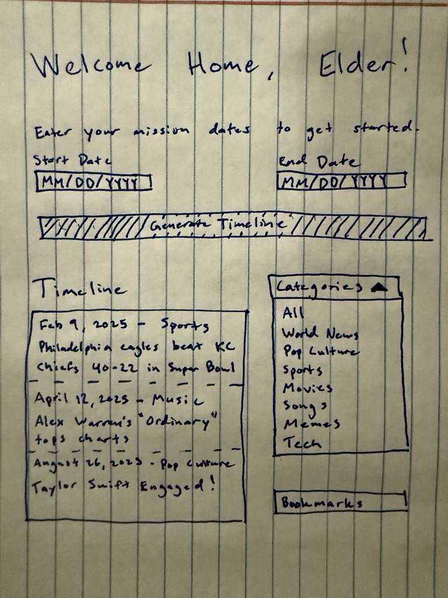
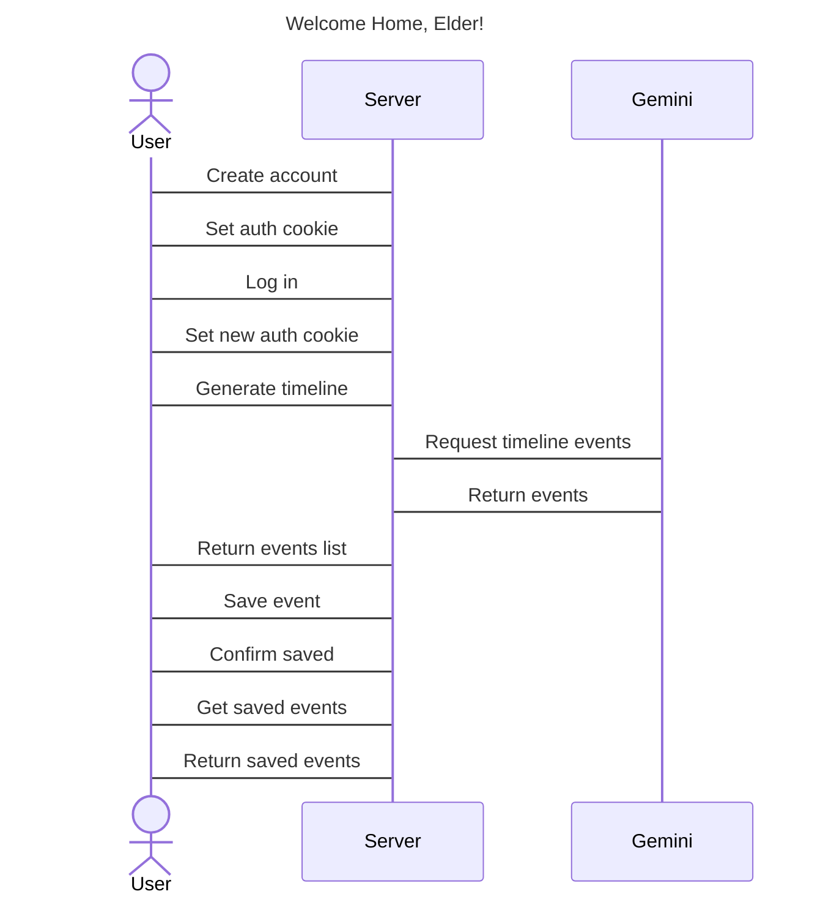

# Welcome Home, Elder!

[My Notes](notes.md)

A web page for returned missionaries that takes in the user's start and end dates of their mission and returns everything that happened in pop culture, the news, and the world as a whole while they were gone.

## 🚀 Specification Deliverable

For this deliverable I did the following. I checked the box `[x]` and added a description for things I completed.

- [x] Proper use of Markdown
- [x] A concise and compelling elevator pitch
- [x] Description of key features
- [x] Description of how you will use each technology
- [x] One or more rough sketches of your application. Images must be embedded in this file using Markdown image references.

### Elevator pitch

Just got home from your mission and feel like the world hit fast-forward while you were gone? Never fear! Just plug in your mission dates, and it’ll instantly show you the big stuff you missed: world events, church news, tech trends, even pop culture. It’s the fastest way to get caught up and back into the swing of things without feeling two years behind.

### Design

### Key features

- Ability to enter in mission start and end dates
- Option to filter by songs, movies, pop culture, world news, etc.
- Display of reviews for rateable items like movies and songs
- Ability to change what category to filter by
- Ability to bookmark events and come back to them later
- Display of timeline for key events
- Videos, photos, and links for popular songs, movies, articles, etc. they missed
- Shareability to social media
- Option to create Spotify playlist from the songs they missed by genre

### Technologies

I am going to use the required technologies in the following ways.

- **HTML** - Provides the structure of the app, including the mission date input, event timeline, and category filters.
- **CSS** - Styles the app with good spacing and colloring and ensures it looks good and works well on all screen sizes, including mobile.
- **React** - Manages dynamic content and interactivity, letting the timeline, event cards, and filters update instantly when users interact.
- **Service** - Backend sercive with endpoints for:
    - login
    - fetches and processes events, news, and media from third party sources
    - retrieving and submitting bookmarked events
- **DB/Login** - Stores user accounts, saved timelines, and preferences. Register and login users. Credentials securely stored in database.
- **WebSocket** - Supports real-time features, like displaying the total amount of people on the webpage as well as the total times each event has been saved.

## 🚀 AWS deliverable

For this deliverable I did the following. I checked the box `[x]` and added a description for things I completed.

- [x] **Server deployed and accessible with custom domain name** - [My server link](https://welcomehomeelder.com).

## 🚀 HTML deliverable

For this deliverable I did the following. I checked the box `[x]` and added a description for things I completed.

- [x] **HTML pages** - Four HTML pages for login, date entry, timeline display, and daved events.
- [x] **Proper HTML element usage** - Used a variety of HTML elements (p, a, img, div, input, button, form, etc.)
- [x] **Links** - Navigation section at the top of each page as well as links from page to page using buttons. 
- [x] **Text** - Headers to descibe each page and text for info on event data from the timeline
- [x] **3rd party API placeholder** - "Generate Timeline" button in date-entry.html will use OpenAI GPT AI to curate a timeline of events the user missed based on the dates they entered.
- [x] **Images** - Added an image to the login page and date entry page, and an icon that appears in the tab up top.
- [x] **Login placeholder** - Input boxes with placeholders for username and password.
- [x] **DB data placeholder** - Option to save events that appear in the saved events page and stay between logins. Events can be removed as well.
- [x] **WebSocket placeholder** - Displays in the header of each page the total amount of people on the webpage as well as the total times each event has been saved next to each event.

## 🚀 CSS deliverable

For this deliverable I did the following. I checked the box `[x]` and added a description for things I completed.

- [x] **Header, footer, and main content body** - Used Bootstrap to style and center the content of the page.
- [x] **Navigation elements** - Created sticky navigation bar at the top of the page that allows for switching between pages.
- [x] **Responsive to window resizing** - Used column and container system from Bootstrap to allow for resizing.
- [x] **Application elements** - Replaced old HTML elements with colorful and sleek Bootstrap designs.
- [x] **Application text content** - adjusted position, sizing, font, and color of text to make it more appealing.
- [x] **Application images** - Replaced old meme images with more theme fitting images on the header of each page.

## 🚀 React part 1: Routing deliverable

For this deliverable I did the following. I checked the box `[x]` and added a description for things I completed.

- [x] **Bundled using Vite** - I bundled my project with Vite for deployment.
- [x] **Components** - Created 4 separate components out of my original login, date entry, timeline, and saved events html files
- [x] **Router** - Implemented router at the top of the webpage on top for easy navigation

## 🚀 React part 2: Reactivity deliverable

For this deliverable I did the following. I checked the box `[x]` and added a description for things I completed.

- [x] **All functionality implemented or mocked out** - Events can be saved and removed, drop down menu sorts events, mock events added, date and username saved to local storage.
- [x] **Hooks** - Used hooks to manage if events are saved or not, updating save count, toggling loading visuals while parsing mock events soon to be from the API.

## 🚀 Service deliverable

For this deliverable I did the following. I checked the box `[x]` and added a description for things I completed.

- [x] **Node.js/Express HTTP service** - Built an express server that listens for HTTP requests and manages backend logic.
- [x] **Static middleware for frontend** - Served the frontend using express.static('public')
- [x] **Calls to third party endpoints** - Used the Google Gemini API to generate timeline events
- [x] **Backend service endpoints** - Created API routes for auth, setting dates, generating timeline, and saving and removing events
- [x] **Frontend calls service endpoints** - Frontend hits service endpoints to get user data about auth, dates, timeline, and saving and removing events
- [x] **Supports registration, login, logout, and restricted endpoint** - Implemented user login with secire cookies and middleware to protect routes

## 🚀 DB deliverable

For this deliverable I did the following. I checked the box `[x]` and added a description for things I completed.

- [x] **Stores data in MongoDB** - User timelines and saved events are stored in MongoDB
- [x] **Stores credentials in MongoDB** - Each user's username, password, and token are stored in MongoDB

## 🚀 WebSocket deliverable

For this deliverable I did the following. I checked the box `[x]` and added a description for things I completed.

- [x] **Backend listens for WebSocket connection** - peerProxy.js creates a WebSocket server that listens for client connections
- [x] **Frontend makes WebSocket connection** - app.jsx creates a WebSocket connection and listens for user count updates from the server
- [x] **Data sent over WebSocket connection** - Active user count is sent over Websocket connection
- [x] **WebSocket data displayed** - Active user count is displayed in the header of all pages.
- [x] **Application is fully functional** - The app allows for account creation, timeline generation using Gemini API, and saving of event, with all data stored in MongoDB
